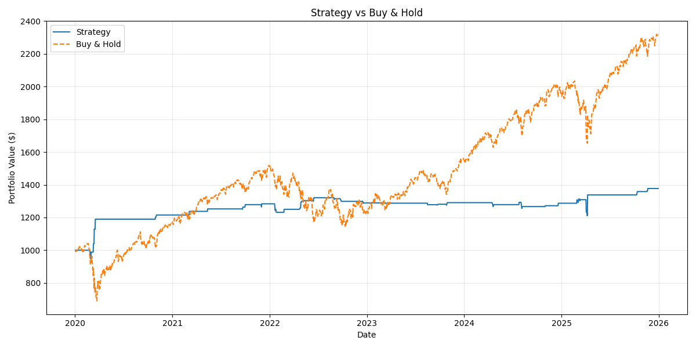
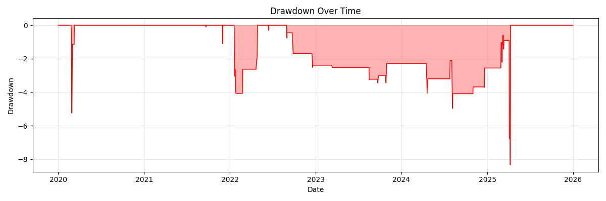

# Algorithmic Trading Backtester

A Python backtesting framework for evaluating quantitative rule based trading strategies against historical price data.

## What it does
Given OHLCV price data for a single asset, this framework:
- Generates daily trading signals from one of several rule-based strategies
- Runs a vectorised backtest (signals shifted by 1 day to avoid lookahead bias)
- Computes standard performance metrics: Total Return, Sharpe Ratio, Max Drawdown, Win Rate, Annualised Volatility
- Supports grid-search parameter optimisation with checks for overfitting (parameter stability heatmaps, train/test splits)
- Benchmarks every strategy against a simple Buy & Hold baseline

## Strategies implemented

| Strategy | Key Parameters | Logic |
| ---- | ---- | ---- |
| Moving Average Crossover | short_window = 50, long_window = 200 | Buy the stock when short MA > Long MA |
| Momentum | lookback = 20 | Buy when N-day return is positive |
| Mean Reversion | lookback = 20, num_std = 2 | Buy when the price deviates too far from the mean |
| Relative Strength Index (RSI) | oversold = 30 | Buy when RSI falls below oversold level |
| Bollinger Band Breakout | lookback = 20, num_std = 2 | Buy when breaks above upper band |
| Moving Average Conversion Diversion (MACD) | short_window = 12, long_window = 26, macd_span = 9 | Buy when MACD line above signal line |
| Volatility Breakout | lookback = 14, multiplier = 1.5 | Buy on ATR-based breakout above prior close |
| Buy and Hold | | Buy on initial day and stay long |


## Results (MSFT, 2020-01-01 - 2025-12-31)

--- Strategy Comparison ---
| Total Return (%) | Sharpe Ratio | Max Drawdown (%) | Win Rate | Annualised Volatility |
| --- | --- | --- | --- | --- |
| Buy and Hold                |  130.7734   |   0.7785     |     -33.7173 |  0.5525          |   0.2075
| Moving Average Crossover    |  91.9974    |   0.9269     |     -18.7552 |  0.5596          |   0.1264
| Momentum                    |  99.1994    |   1.0187     |     -13.3363 |  0.5595          |   0.1203
| Mean Reversion              |  37.7253    |   0.7144     |     -8.3297  |  0.5735          |   0.0792
| RSI                         |  19.2677    |   0.4652     |     -9.5677  |  0.5333          |   0.0684
| Bollinger Band              |  -4.5089    |   -0.3082    |     -8.3751  |  0.5143          |   0.0241
| MACD                        |  50.4244    |   0.6331     |     -15.0492 |  0.5465          |   0.1191
| Volatility Breakout         |  -7.7798    |   -0.4803    |     -7.7798  |  0.5000          |   0.0274

Equity Curve: 
Max Drawdown: 

**Headline finding:** every signal-based strategy underperformed passive Buy & Hold in absolute return over this period - MSFT's sustained 2020–2026 uptrend favoured staying invested over selectively timing entries. Mean Reversion had the best *risk-adjusted* profile (highest Sharpe, shallowest drawdown) despite lower absolute return, which is arguably the more interesting result than chasing the highest return number.

## Limitations 
- **Single Asset, Single Period Evaluation** Results on MSFT (2020 - 2026) are not evidence that the strategies will/won't work on a different asset.
- **No transactional costs modelled** Real returns would be lower, especially for strategies with more signal changes due to transactional costs
- **Basic Strategies Reviewed** Real world strategies used would not be as simple as these
- **Sharpe Ratio Assumes 0% Risk Free Rate** In the real world the risk free rate would be 3+%
- **Can only go long** In a bearish market we can only sit on cash, which isn't representative of the real world

## How to run
```bash
pip install -r requirements.txt
python run_backtest.py
```